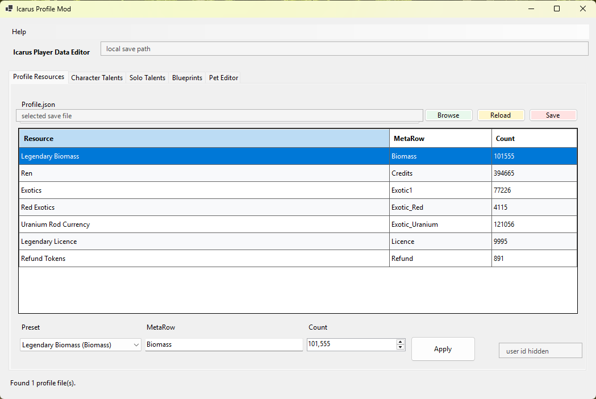
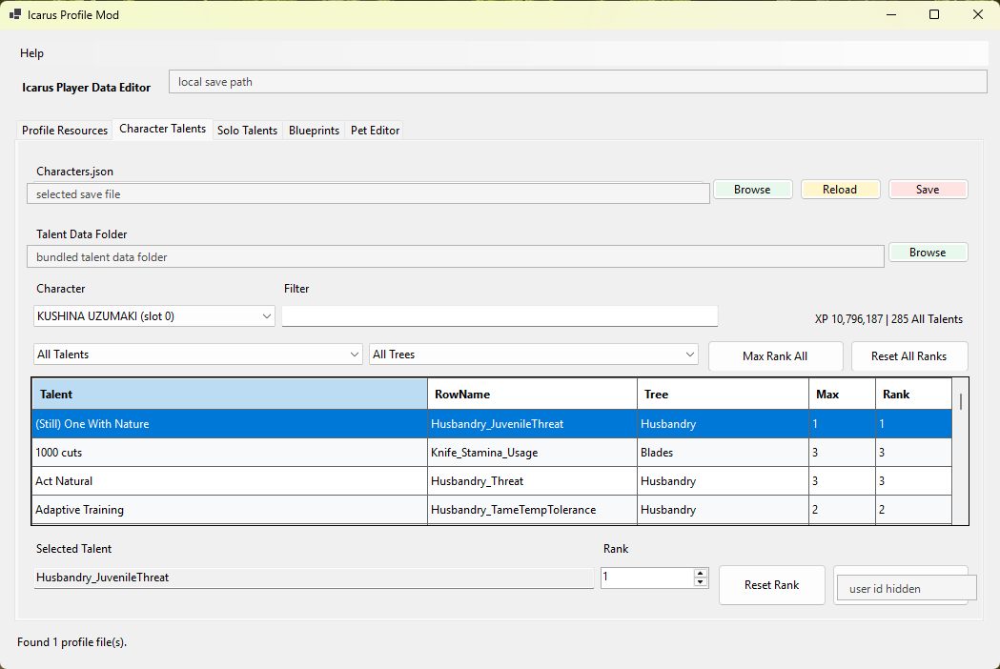
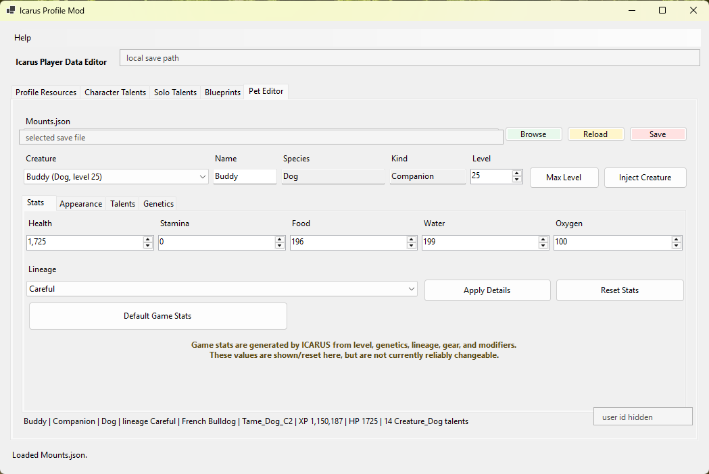

# Icarus Profile Mod

A small Windows player profile save editor for ICARUS. Use it to boost XP, raise character level, unlock talents and blueprints, edit currencies, manage pets and mounts, add animals, adjust breeds/colors/appearance values, edit genetics, and tune supported creature data without hand-editing JSON.

The app is built for the normal ICARUS local save layout. It can automatically find your player data, open `Profile.json`, `Characters.json`, and `Mounts.json`, then create timestamped backups before saving changes.

Default profile location:

```text
%LOCALAPPDATA%\Icarus\Saved\PlayerData\<SteamId>\Profile.json
%LOCALAPPDATA%\Icarus\Saved\PlayerData\<SteamId>\Characters.json
%LOCALAPPDATA%\Icarus\Saved\PlayerData\<SteamId>\Mounts.json
```

## Screenshots

### Profile Resources



### Character Talents



### Pet Editor



## Current Features

- Auto-discovers ICARUS player data files in `%LOCALAPPDATA%\Icarus\Saved\PlayerData`.
- Lets you browse to a specific `Profile.json`, `Characters.json`, or `Mounts.json` manually.
- Shows and edits known `MetaResources` currencies with friendly labels: Ren, Refund Tokens, Exotics, Red Exotics, Legendary Biomass, Legendary Licence, and Uranium Rod Currency.
- Allows adding a missing known currency or custom `MetaRow` by name.
- Loads `Characters.json` and separates progression into Character Talents, Solo Talents, and Blueprints tabs.
- Filters regular character talents by the in-game category groups: All Talents, Survival, Adventure, Habitation, and Combat.
- Filters character talents by individual tree, including an All Trees option.
- Ships with extracted ICARUS data tables in `data\`, then shows display names, trees, max ranks, known mount appearance ranges, and clamps known ranks.
- Supports selected-rank editing, Reset Rank, Max Rank Selected, Max Rank All, and Reset All Ranks where applicable.
- Limits rank spinner controls to the selected talent max rank so the up arrow cannot exceed known valid ranks.
- Loads `Mounts.json`, lets you pick a station-stored creature, edit name, selectable lineage, level, game stat values, phenotype variation values, cosmetic skin indexes, genetics, max level, and creature talent ranks.
- Writes level-linked creature XP from decoded `C_MountExperienceGrowth` and `C_PetExperienceGrowth` game curves.
- Shows health, stamina, food, water, and oxygen as saved game stat values, with reset/baseline tools, but treats them as ICARUS-generated values that may be recalculated by the game.
- Supports Inject Creature by cloning an existing station creature when available, or by using a bundled station-mount template for empty or newly-created `Mounts.json` files.
- Can inject supported station mount and companion creature types such as dog, cat, horse, moa, buffalo, tusker, terrenus, zebra, ubi, mammoth, farm animals, wolves, raptors, draven, slinker, and related variants.
- Creates timestamped backups next to the original file before saving.
- Uses built-in .NET JSON and Windows Forms APIs, plus a local UE4 property serializer for `RecorderBlob.BinaryData` in station mounts.

## Talent Catalog

The app ships with extracted ICARUS data tables in `data\` so talent rank limits and known mount appearance ranges work out of the box:

```text
data\D_AICreatureType.json
data\D_AICurves.json
data\D_AIGrowth.json
data\D_AISetup.json
data\D_CharacterGrowth.json
data\D_GeneticLineages.json
data\D_GeneticValues.json
data\D_Mounts.json
data\D_Talents.json
data\D_TalentTrees.json
data\D_TalentRanks.json
data\D_TamedCreatureModifiers.json
data\D_Tames.json
```

When a catalog is loaded, known talents show display name, talent tree, and max rank. Editing or saving known talents clamps ranks to the loaded catalog max.

The main progression tabs are:

```text
Character Talents  Regular player talents, grouped by category and tree
Solo Talents       Solo player talents
Blueprints         Blueprint unlock rows
Pet Editor         Station pet, mount, farm animal, appearance, genetics, and creature talent editing
```

Rank edits update the loaded in-memory data immediately. The file is not written until you click that tab's `Save` button. Selected `Reset Rank` and `Max Rank Selected` actions work on one or more selected rows. Bulk `Max Rank All` and `Reset All Ranks` actions are scoped to the active tab/view.

If ICARUS updates and the bundled data becomes stale, refresh the extracted tables from the local game install with:

```powershell
python .\tools\extract_icarus_data.py
python .\tools\extract_icarus_curves.py
```

The raw `data.pak` and content `.pak` files are intentionally ignored and should not be committed. The app auto-loads bundled files on startup, and the `Catalog...` button can load a different talent catalog folder manually by selecting its `D_Talents.json` file.

## Pet Editor

The Pet Editor tab edits station-stored animals saved in:

```text
%LOCALAPPDATA%\Icarus\Saved\PlayerData\<SteamId>\Mounts.json
```

Supported creature editing currently focuses on station-stored pets, mounts, and farm animals only. Animals deployed into an active prospect may be stored in prospect/world data and are out of scope for this editor.

The app decodes and rewrites the UE4 serialized `RecorderBlob.BinaryData` structure used by station creatures. This enables editing creature talent ranks, selectable lineage, genetics, phenotype variation values, cosmetic skin indexes, and common creature stats instead of doing unsafe byte/string replacement.

If `Mounts.json` is missing for the selected player data folder, the app asks before preparing a new one. The file is created only when you click `Save`.

`Inject Creature` adds a generic station creature by cloning an existing station mount entry when one is available. If the file is empty or newly-created, it falls back to the bundled `data\MountTemplate.json`, then patches the selected animal type, AI setup row, blueprint class, name, generated actor/object IDs, owner player ID, level, and editable arrays.

Level edits update `MountLevel`, `LastLevelAchieved`, and `Experience`. The XP value is resolved from decoded mount/pet experience curves in bundled game data when available, with a fallback estimate only if those curves cannot be loaded.

The Stats tab shows saved health, stamina, food, water, and oxygen values, plus `Reset Stats` for restoring the values loaded from `Mounts.json` and `Baseline Stats` for applying decoded baseline values from bundled game data. ICARUS can recalculate final values from level, genetics, lineage, gear, and modifiers when the creature loads, so direct stat edits are not considered reliably persistent.

Injected creatures choose starter lineage from the bundled `D_GeneticLineages.json` weighting table, so common `Wild` rolls are more likely than rare lineages such as `Alpha`.

Appearance editing exposes the saved `Variation`, `UniqueVariation`, `CosmeticSkinIndex`, and `CosmeticSkinIndex_0` values. Phenotype support is still experimental because valid ranges and visual names vary by creature type.

Genetics editing uses a compact two-column editor for the seven known saved genetic values: Vitality, Endurance, Muscle, Agility, Toughness, Hardiness, and Utility. Values are clamped from `0..10`. `Randomize Genetics` defaults to a conservative `2..6` range because the exact ICARUS genetics roll distribution is still unproven; an experimental full `1..10` mode is available for testing documented natural genotype bounds.

## Project Layout

```text
IcarusProfileMod.csproj  C# Windows Forms project
Program.cs               App entry point
MainForm.cs              Main Windows UI
IcarusProfile.cs         Profile.json load/edit/save logic
IcarusCharacters.cs      Characters.json load/edit/save logic
IcarusMounts.cs          Mounts.json load/edit/save and UE4 property handling
TalentCatalog.cs         Optional ICARUS talent metadata loader
InjectMountDialog.cs     Inject Mounts selection dialog
ProfileFinder.cs         ICARUS player data discovery
publish.ps1              Release build script
assets/                  Source image assets
data/                    Bundled extracted ICARUS data tables
tools/                   Maintenance scripts for refreshing extracted data
artifacts/               Generated publish output, ignored by Git
```

## Build Requirements

Install the .NET 8 SDK for Windows:

https://dotnet.microsoft.com/download/dotnet/8.0

The runtime alone is not enough; publishing the `.exe` requires the SDK.

## Run From Source

```powershell
dotnet run
```

## Build A Windows .exe

```powershell
.\publish.ps1
```

The generated app will be placed in:

```text
artifacts\win-x64\IcarusProfileMod.exe
```

Release zips are named like:

```text
artifacts\IcarusProfileMod-v1.1.3-win-x64.zip
```

The zip should include:

```text
IcarusProfileMod.exe
IcarusProfileMod.pdb
data\D_TalentRanks.json
data\D_Talents.json
data\D_TalentTrees.json
data\D_Mounts.json
data\D_AISetup.json
data\D_AICreatureType.json
data\D_AICurves.json
data\D_AIGrowth.json
data\D_CharacterGrowth.json
data\D_GeneticLineages.json
data\D_GeneticValues.json
data\D_TamedCreatureModifiers.json
data\D_Tames.json
data\MountTemplate.json
```

## Manual Publish Command

```powershell
dotnet publish .\IcarusProfileMod.csproj -c Release -r win-x64 --self-contained true -p:PublishSingleFile=true -p:IncludeNativeLibrariesForSelfExtract=true -o .\artifacts\win-x64
```

## Safety Notes

Close ICARUS before saving changes. Steam Cloud may overwrite local files if the game or Steam sync is active while editing.

Backups are created automatically, but keep an extra copy of `Profile.json`, `Characters.json`, and `Mounts.json` before experimenting with new edits.

The Mounts tab is still newer than the profile and character editors. Test changes with expendable or backed-up saves first, especially injected mounts and creature talents.
